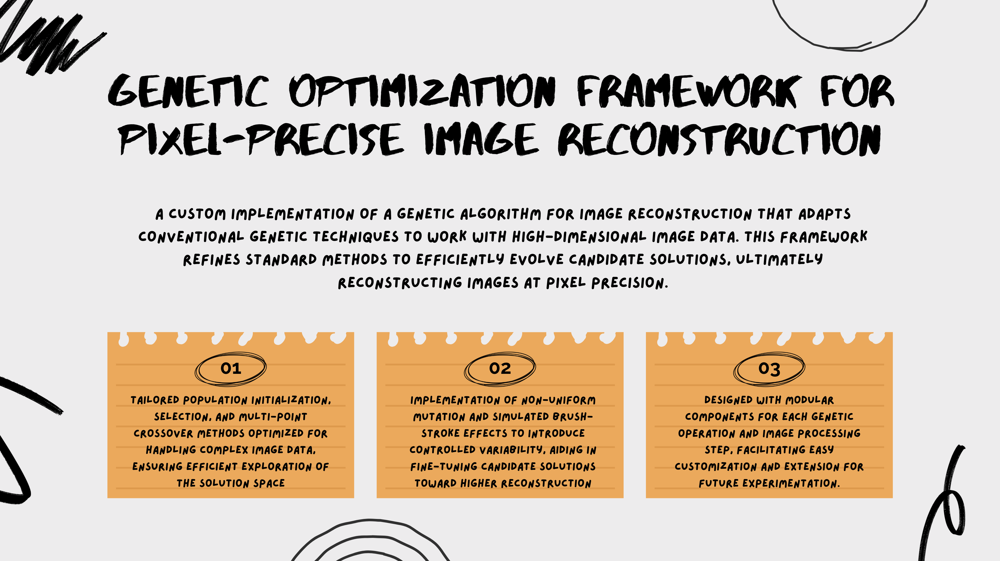
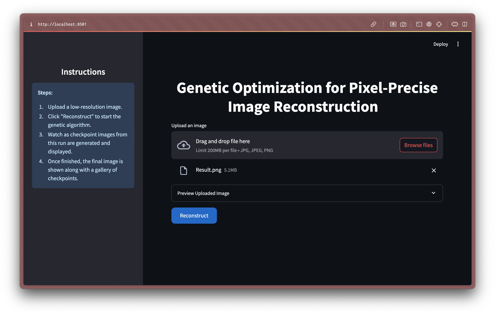
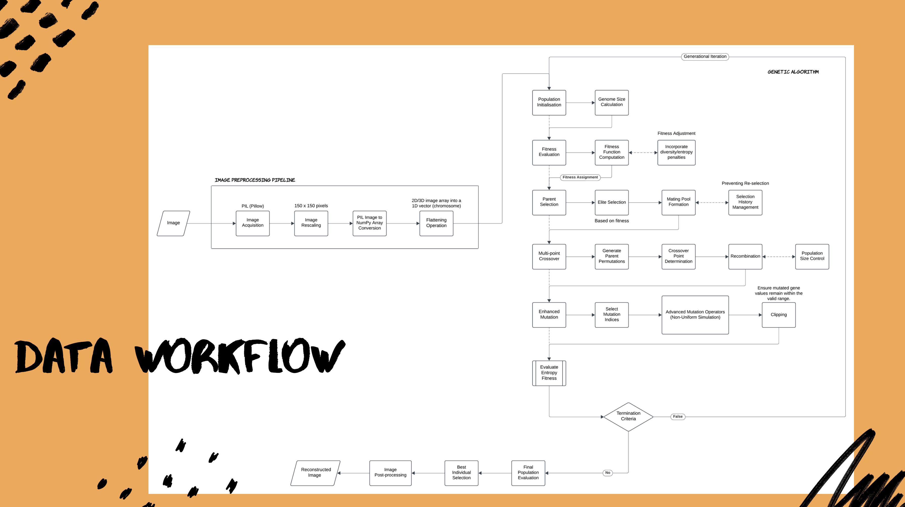

# Genetic Optimization Framework for Pixel-Precise Image Reconstruction

The **Genetic Optimization Framework for Pixel-Precise Image Reconstruction** is a custom implementation of a standard genetic algorithm tailored for the task of image reconstruction. Building upon classical genetic algorithm principles, this project integrates several improvements to efficiently evolve candidate solutions for reconstructing images at the pixel level. Our implementation includes enhancements such as checkpointing, streamlined mutation operations, and a responsive Streamlit UI for real-time visualization of the reconstruction process.



This repository contains all the necessary scripts along with a Docker-based setup for easy installation and deployment.


## File Requirements

For running inference using the Streamlit UI, the following data files and directories are required:
- **Input Images:** Low-resolution images (JPG, JPEG, or PNG) should be placed in `data/raw`
- **Processed Data & Checkpoints:** The reconstructed images and checkpoint images will be saved in `data/processed`  
  - Final reconstructed image is saved as `solution.png`
  - Intermediate checkpoint images are saved in `data/processed/checkpoint`

## Features

- **Custom Genetic Algorithm Implementation:**
  - **Population Initialization:** Generates a set of candidate solutions from the input image.
  - **Fitness Evaluation:** Uses the sum of absolute pixel differences to evaluate how close a candidate image is to the target.
  - **Selection, Crossover, and Mutation:** Implements standard genetic operations with custom enhancements tailored for image data.
  - **Checkpointing:** Saves intermediate checkpoint images at specified intervals for progress tracking.
  - **Final Output Saving:** The best candidate (final reconstruction) is saved as `solution.png`.

- **Interactive Reconstruction Inference:**
  - **Streamlit-Based UI:** An interactive interface for uploading an image and visualizing the reconstruction process.
  - **Live Progress Updates:** Displays a loading UI with periodic updates of the latest checkpoint image.
  - **Side-by-Side Comparison:** Compares a resized version of the original input image with the final reconstructed image.


## Installation and Setup

1. Clone the repository and Navigate to root directory.
2. Run the following command to build the Docker image and start the application:
    ```bash
    docker compose up --build
    ```
3. Open your browser and navigate to
    ```bash
    http://localhost:8501
    ```
    


## How to Run

### Inference Using the Streamlit App

1. **Upload an Image:**
   - Navigate to the Streamlit UI in your browser (e.g., `http://localhost:8501`).
   - Upload a low-resolution image from the `data/raw` folder.

2. **Run Reconstruction:**
   - Click the **"Reconstruct"** button to start the genetic algorithm.
   - Watch as the app displays a loading UI and periodically updates with the latest checkpoint image from `data/processed/checkpoint`.

3. **View Final Output:**
   - Once the genetic algorithm completes, the final reconstructed image is saved as `solution.png` in `data/processed` and displayed alongside a side-by-side comparison with the resized original image.


## Technology Stack

- **Programming Language:** Python
- **Frameworks/Libraries:** 
  - Streamlit (for interactive UI)
  - OpenCV & PIL (for image processing)
  - NumPy (for numerical computations)
  - Matplotlib (for saving images)
- **Containerization:** Docker (for easy deployment)




## Troubleshooting

- **Final Image Not Being Saved:**
  - Ensure that the `data/processed` folder exists and is writable.
  - Old checkpoint files are cleared automatically before a new run; if issues persist, manually delete `data/processed` contents.

- **UI Issues:**
  - If the Streamlit app does not render correctly, clear your browser cache or try a different browser.

- **Performance Issues:**
  - Genetic algorithm inference can be slow. Consider resizing input images or adjusting genetic parameters for faster convergence.


## Legal Attribution

This project builds upon the classical genetic algorithm framework, which has been widely studied and implemented. Our custom modifications for image reconstruction are an original extension of standard techniques, aiming to deliver pixel-precise results. While the genetic algorithm concept is well-established, our specific approach for image reconstruction and the enhancements implemented in this project are under MIT license.

For further reading on genetic algorithms, see:
- Goldberg, D. E. Genetic Algorithms in Search, Optimization, and Machine Learning.

---

