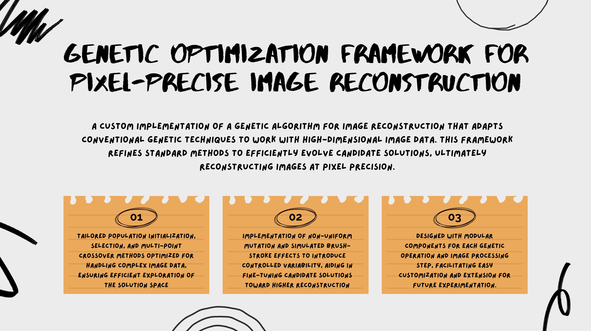
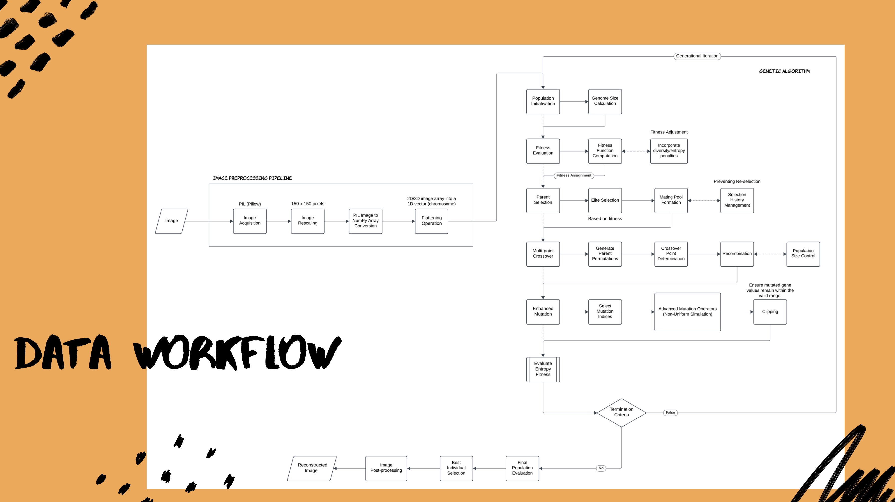
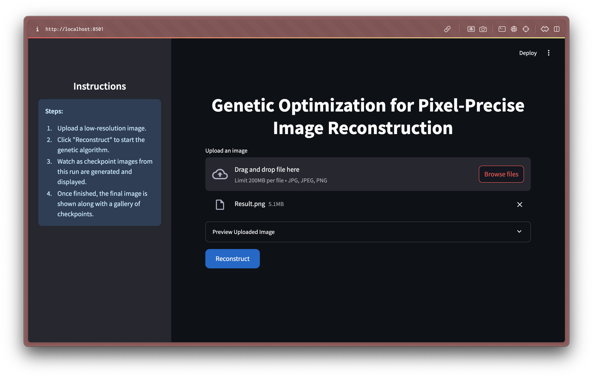

<!-- ============================ HEADER ============================ -->
<h1 align="center">Genetic Optimization Framework for Pixel-Precise Image Reconstruction</h1>

<p align="center">
  <em>A genetic algorithm that reconstructs images pixel by pixel through evolution — no gradient descent, no neural networks.</em>
</p>

<!-- Badges. Generate at https://shields.io/. -->
<p align="center">
  <a href="https://github.com/Keegz-dz/Genetic-Optimisation-Framework-for-Pixel-Precise-Image-Reconstruction/commits/main">
    
  </a>
  <a href="./LICENSE">
    
  </a>
  <a href="https://opencv.org/">
    
  </a>
  <a href="https://www.python.org/downloads/release/python-3100/">
    
  </a>
  <a href="#">
    
  </a>
</p>

<!-- Animated demo GIF which conveys the project's value instantly. -->
<p align="center">
  
</p>
<p align="center">
  <sub>
    Reconstruction output captured at the 200,000-generation checkpoint.
  </sub>
</p>


<!-- ============================ TL;DR ============================ -->
## Overview
This project frames image reconstruction as an evolutionary optimisation problem. Each candidate image is encoded as a flat byte array — chromosome,  and evolved across hundreds of thousands of generations through fitness-guided selection, multi-point crossover, and enhanced mutation strategies. Rather than learning a reconstruction mapping through gradient descent or latent representations, the algorithm applies evolutionary pressure directly to raw pixel values, progressively improving reconstruction quality through population-based search.

The result is a transparent and interpretable reconstruction process in which every generation, operator, and mutation step remains explicitly observable. No learned weights or neural feature representations are involved. The project demonstrates how evolutionary computation can be used to approximate image reconstruction through direct optimisation in pixel space, providing an alternative perspective to the neural approaches that dominate modern image processing.



<!-- ============================ TOC ============================ -->
## Table of Contents

1. [Key Results](#key-results)
2. [Demo](#demo)
3. [Architecture](#architecture)
4. [Installation](#installation)
5. [Project Structure](#project-structure)
6. [Training and Evaluation](#training-and-evaluation)
7. [Limitations](#limitations)
8. [Citation](#citation)
9. [Acknowledgements](#acknowledgements)
10. [Licence](#licence)
11. [Contact](#contact)


<!-- ============================ RESULTS ============================ -->
## Key Results

The framework was evaluated on a **150 × 150 RGB image** over **300,000 generations**
using a population size of **8**, **4 mating parents**, and a mutation rate of **1%**. MAE is normalised to [0, 1].

<div align="center">

| Method | MAE | PSNR (dB) | SSIM |
|:--|:--:|:--:|:--:|
| Random Baseline | 0.2894 | 9.12 | 0.0069 |
| **Evolutionary Reconstruction Framework (Ours)** | **0.1769** | **12.36** | **0.2770** |
| **Relative Improvement** | **−0.1125** | **+3.24** | **+0.2701** |

</div>

<p align="center">
  <sub>
    Lower MAE indicates better reconstruction accuracy,
    while higher PSNR and SSIM values indicate improved perceptual quality and structural similarity.
  </sub>
</p>


<br>

<p align="center">
  
  &nbsp;
  
</p>
<p align="center">
  <sub>
    Target image (left) and reconstructed output after 300,000 generations (right).
  </sub>
</p>

<br />
The substantial improvement in SSIM over the random baseline demonstrates that the framework
successfully recovers coherent structural and colour patterns rather than converging toward noise.
<br>
<br>
<p align="center">
  
</p>

<p align="center">
  <sub>Best-individual fitness progression across generations.</sub>
</p>

<!-- ============================ DEMO ============================ -->
## Demo

https://github.com/user-attachments/assets/e5f111f9-b5cc-4ded-9ff7-c10399a1fd3c

<p align="center">
  <sub>
    Reconstruction output captured at the 140,000-generation checkpoint.
  </sub>
</p>

<!-- ============================ ARCHITECTURE ============================ -->
## Architecture

The system is composed of three layers: image preprocessing, the genetic algorithm core and a modular operator library. Each layer has a single responsibility and communicates through well-defined inputs and outputs.

<p align="center">
  
</p>

### Chromosome representation

Every image is encoded as a flat `uint8` array of length
`150 × 150 × 3 = 67,500` — one value per colour channel per pixel, laid out
in row-major order. This bijective mapping means every gene index corresponds
to exactly one pixel-channel combination, and the full image can be
reconstructed from any chromosome with a single reshape. The `uint8` dtype
keeps each individual at 67.5 KB, making a population of 8 just 540 KB in
memory.

### Fitness evaluation

Fitness is computed as `sum(target) − MAE(target, candidate)`, converting a
minimisation problem (reduce pixel error) into a maximisation objective
(increase fitness). Arithmetic is intentionally left in `uint8` space to match
the representation, which introduces an asymmetric penalty — overshooting a
pixel value is penalised more than undershooting — and the algorithm was tuned
around this behaviour.

### Selection

A greedy elitist strategy selects the top `num_parents_mating` individuals by
fitness score. The selected parents are copied directly into the next
generation, guaranteeing that the best solution found so far is never
discarded. The remaining slots are filled by offspring.

### Crossover

Multi-point crossover draws three parents at random and places two cut points
along the chromosome, producing an offspring composed of alternating segments
from each parent. This preserves longer contiguous pixel regions which
correspond to spatial features in the image, better than single-point
crossover, and introduces more genetic diversity per generation by mixing
material from three sources rather than two.

### Mutation

The enhanced mutation operator applies two sequential perturbations to each
offspring chromosome:

1. **Colour delta** — a random integer in [−20, 20] is added to each selected
   gene, simulating a small local colour shift.
2. **Non-uniform scaling** — the gene is further multiplied by a random
   strength in [−1, 1], introducing variable-magnitude perturbations that
   prevent the population from clustering around a narrow colour range.

Values are clipped to [0, 255] after each step. Parent chromosomes are never
mutated, preserving elitist solutions across generations.

<!-- ============================ INSTALLATION ============================ -->
## Installation

### Prerequisites

- Python 3.10
- 4 GB RAM (8 GB recommended for longer runs)
- At least 1 GB of free disk space (for generated outputs and checkpoint images)

### Quick start

Run the application locally with a Python virtual environment:

1. Create and activate a virtual environment:
    ```bash
    python -m venv .venv
    source .venv/bin/activate
    ```
2. Install the required dependencies:
    ```bash
    pip install --upgrade pip
    pip install -r requirements.txt
    ```
3. Launch the Streamlit application:
    ```bash
    streamlit run streamlit_main.py
    ```
4. Open your browser and navigate to [http://localhost:8501](http://localhost:8501).

  

<!-- ============================ STRUCTURE ============================ -->
## Project Structure

```
Genetic-Optimisation-Framework-for-Pixel-Precise-Image-Reconstruction/
│
├── model/
│   ├── genetic_model.py       # Orchestrates the full GA loop
│   └── helpers/
│       └── saving.py          # Chromosome-to-image conversion and checkpoint file writing
│
├── modules/                   # Genetic operator library: each operator is an independent module
│   ├── population.py          # Random population initialisation
│   ├── fitness.py             # Fitness evaluation and population-level scoring
│   ├── selection.py           # Elitist parent selection
│   ├── crossover.py           # Single-point and multi-point crossover strategies
│   └── mutation.py            # Basic, enhanced, and brush-stroke mutation strategies
│
├── scripts/
│   ├── image_parameters.py    # Image loading, resizing, and chromosome encoding
│   ├── inference.py           # CLI runner with side-by-side output display
│   └── evaluate.py            # reports MAE, PSNR, and SSIM against a random baseline
│
├── data/
│   ├── raw/                   # Input images to be reconstructed
│   └── processed/
│       ├── solution.png       # Final reconstruction output
│       └── checkpoint/        # Intermediate reconstructions saved every 20,000 generations
│
├── assets/                    # Images used in README
│
├── streamlit_main.py          # Browser-based inference UI
├── requirements.txt           
└── environment.yml            
```

<!-- ============================ TRAINING ============================ -->
## Training and Evaluation

This project has no offline training phase. The genetic algorithm is the
optimisation process itself — each run reconstructs a specific target image
from scratch. The three steps below cover data preparation, running a
reconstruction, and evaluating the result.


### Data preparation

Place the image you want to reconstruct in `data/raw/`. Any JPEG or PNG is
accepted. The algorithm internally resizes every input to 150 × 150, so
original resolution does not affect the output dimensions.

```bash
cp /path/to/your/image.jpg data/raw/image.jpg
```

Expected output: the file appears in `data/raw/`. No processing happens at
this stage.


### Reconstruction

```bash
python scripts/inference.py data/raw/image.jpg
```

Expected output:

```
Running Genetic Algorithm: 100%|████████████| 300000/300000 [32:14<00:00, 155.1gen/s]
```

Checkpoint images are written to `data/processed/checkpoint/` every 20,000
generations. The final reconstruction is saved to `data/processed/solution.png`
at termination and displayed as a side-by-side comparison with the resized
original. Pass `--no-display` to skip the matplotlib window.

### Evaluation

```bash
python scripts/evaluate.py data/raw/image.jpg --generations 300000 --save-visuals
```

Expected output:

```
-----------------------------------------------------------------
Method                                  MAE ↓    PSNR ↑    SSIM ↑
-----------------------------------------------------------------
Random baseline                        0.2894     9.12 dB    0.0069
This framework (enhanced)              0.1769    12.36 dB    0.2770
-----------------------------------------------------------------

MAE is normalised to [0, 1].
Results saved to assets/eval_results.txt
Target (150×150) saved to   assets/eval_target.png
Reconstruction saved to     assets/eval_reconstruction.png
```

Results are written to `assets/eval_results.txt`. With `--save-visuals` the
150 × 150 target and the final reconstruction are saved to `assets/` as
matched-resolution PNGs for direct visual comparison.

<!-- ============================ LIMITATIONS ============================ -->
## Limitations

1. **Resolution is currently fixed at 150 × 150.** The chromosome length scales with `height × width × 3`, meaning the search space grows cubically with image resolution. At 150 × 150, a single generation evaluates 67,500 genes per individual; at 512 × 512, this increases to approximately 786,000 genes. As a result, a 300,000-generation run that completes in roughly 3 minutes at 150 × 150 can extend to hours on a CPU at higher resolutions. The current implementation does not include GPU acceleration, making high-resolution reconstruction computationally impractical without significant optimisation or architectural changes.

2. **Each reconstruction is performed entirely from scratch.** Unlike trained neural networks, the framework does not learn transferable representations between runs. Every reconstruction begins with a newly initialised random population and repeats the complete evolutionary search process independently. There are no reusable weights, latent representations, or warm-start mechanisms. Consequently, computational cost scales linearly with the number of images being reconstructed.

3. **Reconstruction quality remains below modern learned approaches.** After 300,000 generations, the framework achieves 12.36 dB PSNR and 0.277 SSIM on the evaluation image. By comparison, conventional super-resolution CNNs operating on the same task routinely exceed 30 dB PSNR. This performance gap reflects a fundamental methodological difference: the genetic algorithm explores pixel space through evolutionary search alone, without any learned prior over natural image statistics. The project demonstrates that evolutionary optimisation can recover coherent image structure, but it is not intended to compete with gradient-based deep learning methods in reconstruction fidelity.

4. **Convergence behaviour is highly image-dependent and not guaranteed.** Images containing large uniform regions or simple colour distributions typically converge reliably within 300,000 generations. In contrast, high-frequency or highly detailed photographic images often plateau early, with only marginal improvements observed during later generations, as demonstrated in the evaluation on `test.png`. The current implementation does not include adaptive stopping criteria, diversity-preservation strategies, or recovery mechanisms for premature convergence.

<!-- ============================ CITATION ============================ -->
## Citation

If you use this work in your research, please cite:

```bibtex
@software{dsouza2023genetic_ir,
  author       = {Dsouza, Keegan and Chaudhary, Atharv Girish},
  title        = {Genetic Optimization Framework for Pixel-Precise Image Reconstruction},
  year         = {2023},
  url          = {https://github.com/Keegz-dz/Genetic-Optimisation-Framework-for-Pixel-Precise-Image-Reconstruction},
  version      = {1.0.0}
}
```

<!-- ============================ ACKNOWLEDGEMENTS ============================ -->
## Acknowledgements
This project builds on the following prior work:
- **Ahmed Fawzy Mohamed Gad (2020).** *GARI: Genetic Algorithm for Reproducing Images.* Foundational implementation of evolutionary image reconstruction using genetic algorithms. Portions of the operator logic and reconstruction methodology were adapted and extended from the original implementation under the MIT Licence. [GitHub Repository](https://github.com/ahmedfgad/GARI)

- **Goldberg, D. E. (1989).** *Genetic Algorithms in Search, Optimization, and Machine Learning.* Addison-Wesley. Foundational theoretical framework for the selection, crossover, and mutation strategies employed throughout this project.

<!-- ============================ LICENCE ============================ -->
## Licence
 
This project is released under the MIT Licence. See [`LICENSE`](LICENSE) for full text.

<!-- ============================ CONTACT ============================ -->
## Contact

Maintained by [Keegan Dsouza](https://github.com/Keegz-dz). For bug reports and feature requests, please open an issue on the [issue tracker](https://github.com/Keegz-dz/Genetic-Optimisation-Framework-for-Pixel-Precise-Image-Reconstruction/issues).

<p align="left">
  <a href="https://www.linkedin.com/in/keegan-dz/">
    
  </a>
  <a href="mailto:keegz29.dz@gmail.com">
    
  </a>
  &nbsp;&nbsp;
  <a href="https://www.linkedin.com/in/atharv-girish-chaudhary-529848378/">
    
  </a>
  <a href="mailto:chaudharyatharvgirish@gmail.com">
    
  </a>
</p>
